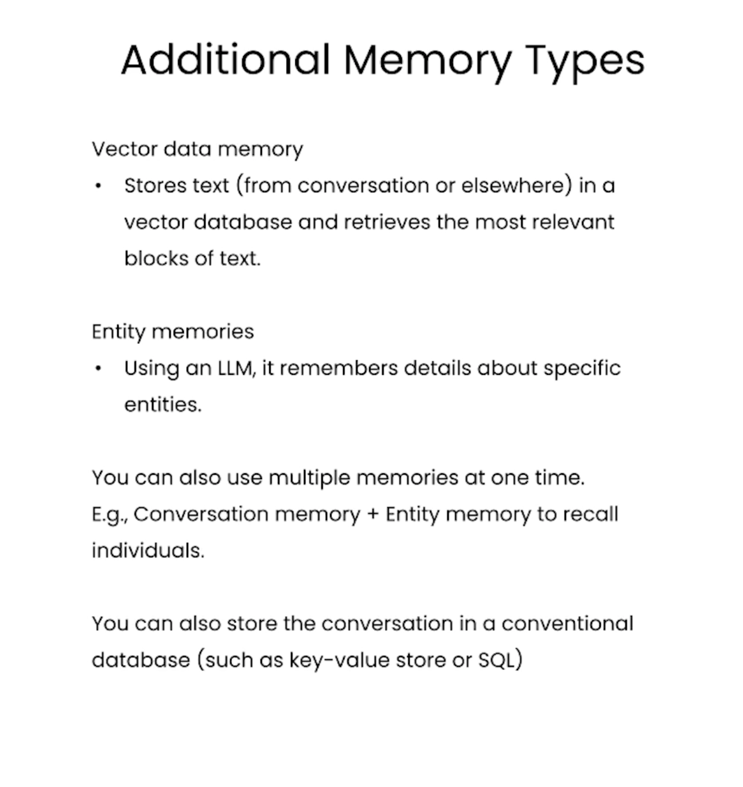

### LangChain 

- Open-source development framework for LLM applications  
- Focused on composition and modularity  
- Key value adds:  
  1. Modular components  
  2. Use cases: common ways to combine components  
- Components  
  - Models  
    - LLMs, chat models, text embegging models  
  - Prompts  
    - Prompt templates, output parsers, example selectors  
  - Indexes  
    - Document loaders, text splitters, vector stores, retrievers  
  - Chains  
    - Prompt + LLM + Output parsing  
    - Can be used as building blocks for larger chains  
    - More application-specific chains  
  - Agents  
    - Algorithms for getting LLMs to use tools  
    - Agent toolkits: agents armed with specific tools for a specific application  

### Memory
  

  

### Chains

- Sequential Chains: combine multiple chains where the output of one chain is the input of the next chain
- Two types: 
  - SimpleSequentialChain: single input / output
  - SequentialChain: multiple inputs / outputs
- Router Chain: Route an input to a subchain depending on the input content.

### Question and Answer 

- LLM's can only inspect a few thousand words at a time. How can it inspect a document? 
- Embeddings: numerical representation for pieces of text 
  - captures semantic content 
  - text with similar conent have similar vectors   
  - in numeric space similar information is close  

- __Vector Database__: a way to store vector representations 
  - populate with chunks of text coming from incoming documents  
  - break a large document into chunks --> create embedding for each chunk --> store in vector database --> pass only relevant ones to language model  
- Query --> Create embedding of query --> compare to all vectors in database, pick n most similar --> pass those to llm prompt --> get response  

- __Stuff method__: stuff all data into the prompt as context to pass to the language model    
  - Pros: It makes a single call to the LLM. The LLM has access to all the data at once.  
  - Cons: LLMs have context length, and for large documents or many documents this will not work, as it will result in a prompt larger than the context length  

- __Other Methods__:  

