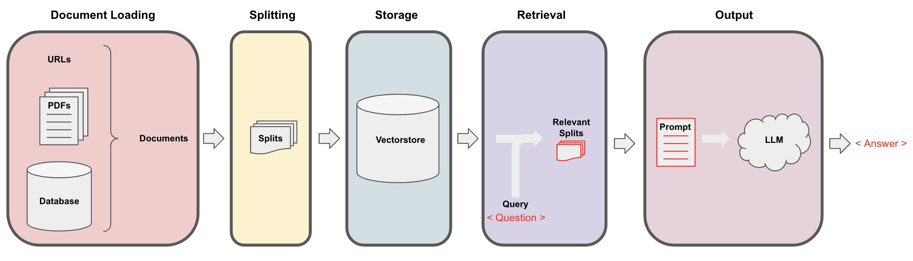

# Course Notes

## Document Loading 

- Goal: load data into a format such that it can be processed by LLM.  
- Loaders: deal with specifics of accessing and converting data  
  - returns a list of `Document` objects  

## Document Splitting 

- Goal: split data into smaller chunks  
- Challenge: how to retain meaningful relationships  
  - Solution: split with chunk overlap, enabling context to remain at start and end of chunks. 
- Text Splitters: Langchain modules for splitting texts  

## Vector Stores and Embeddings  

- Vector stores: databse where you can easily look up embeddings vectors 
  - Example workflow: create an embedding of a question, look in vector store, select the most relevant  

## Retrieval  
- Maximal Marginal Relevance  
  - you may not always want to choose the most similar responses to the query  
  - Query the vector store   
  - Choose the `fetch_k` most semantically similar response  
  - Within those responses choose the `k` most diverse  

- LLM Aided Retrieval 
  - There are sevaral situations where the query applied to the database is more than just the question.  
  - SelfQuery: use an LLM to convert the user question into a query  
  - Workflow: Question > Query Parser > filter + search term  

- Compression  
  - Pull out only most relevant bits  
  - Workflow: Question > Store > Get relevant splits > Compression LLM > Compress relevant splits 