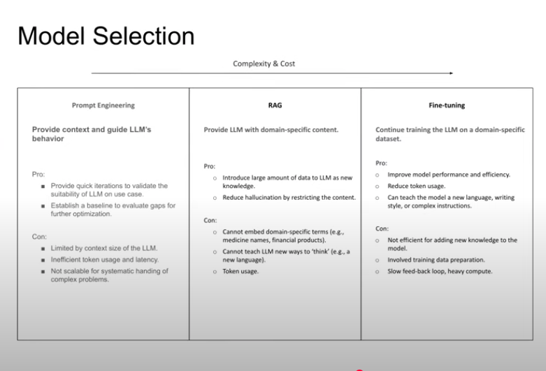
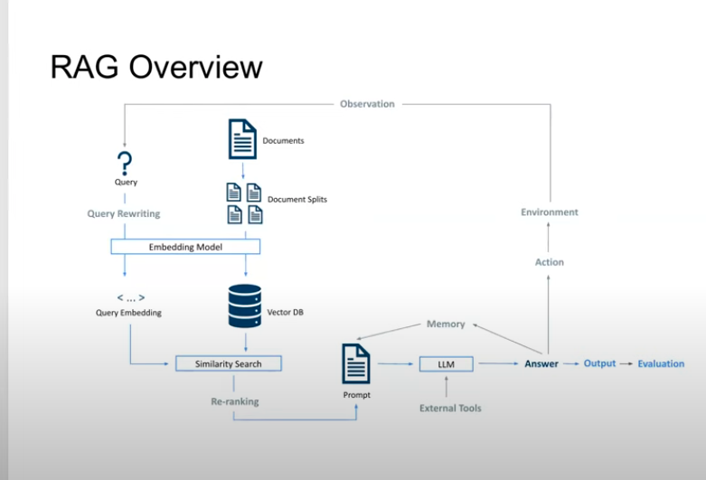
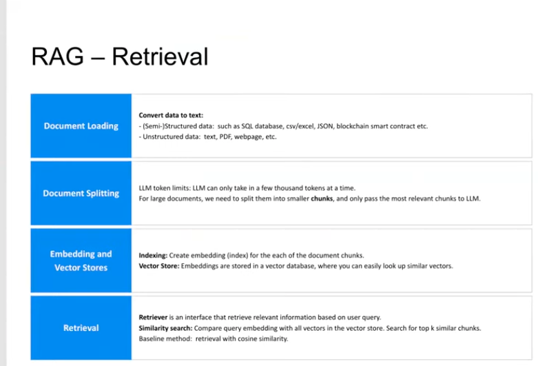

## Kickoff Meeting

- A risk manager or financial analyst may need to...  
  - Read regulation documents to search parts of rule or detect recent rule change, e.g. text, pdf  
  - Sentiment analysis based on news articles  
  - Extract market data for prices, volumes, ...  
  - Augment features from unstructured data as input of other machine learning models  

- Can we build an AI-powered financial assistant?  
  - LLM:  
     - Extract structured information from unstructured files  
     - Translation, Summarization, Classification, Content Generation  

  - LLM + Tools 

### What is an LLM?  

GPT  
- Generative: capable of predicting content  
- Pre-trained: Saved networks with weights pre-trained on large data  
- Transformer: Transform an input into another type of output  

Embedding  
- Embedding model (encoder) creates vector representation of a piece of text that captures its semantic meaning in its context 
- Vector similarity measured by cosine similarity  

Self-attention  
- Capture a long-range dependencies and contextual information in natural language  

Transformer
- Deep learning framework composed of a stack of self-attention layers  
- Traditional Transformer: voice-to-text, text-to-voice, text-to-image, etc.  
- GPT: Generate text by sequentially predicting the next token in a sentence given the preceding tokens  

### Methods to optimize LLM Usage  

![alt text][images/optimize-llm-usage]  

### Model Selection  

  

### RAG Overview  

- Using RAG can help avoid hallucination  

### RAG - Retrieval  

### RAG - Generation  

### RAG Optimization  

- Model Selection: Use embeddings and LLM models fine-tuned on domain data  

- Document splitting Optimziation: Retain meaningful semantic relationships  
  - Experiment with the optimal chunk size and chunk overlap  
  - Define a heirarchy of separators, e.g. sections, paragraphs, sentences  
  - Define additional metadata for metadata filter  

- Query Rewriting  
  - Use LLM to rewrite the query, to optimize the format and implement constraints, e.g. split the original question to a filter on metadata and search  
  - Hypothetical document embedding (HyDE): use LLM-generated hypothetical answer for similarity search 

- Hybrid Search: Use a combination of vector search and keyword search  

- Reranking: Use a two-stage pass for more accurate retrieval  
  - Stage 1: Use embeddings-based retrieval to get a large set of candidate data chunks (fast, but less accurate)  
  - Stage 2: Recalculate similarity for all candidates using original data (rules-based, LLM-based, etc)  

- Router: Classify the query and select the most relevant content, tools, or query engines based on the class  

- Tools: Integrate external functions or services, such as search engines, math tools, SQL database, or custom APIs  

### Agentic RAG  

- Agentic RAG  
  - Use LLM as a reasoning engine to take actions  
  - Make multi-step decisions for task management and tool usage  

- Example use case: simple cryptocurrency analyzer  
  - LLM model: an offline LLM model (llama 3.1) is used to ensure data privacy. All LLM computations are computed locally.  
  - Tools provided to the LLM: Functons to query price and trading volume and Wikipedia API  

### Knowledge Graph  

- Transform textual data into structured and relational representation, e.g. relational database (MySQL) or graph database (Neo4j)  
- Objective: navigate through documents with complext interconnections; enable efficient information retrieval  
- Example Use Case: Knowledge graph for Basel Rule Market Risk  
- If you give this graph to another LLM, the second LLM can use the graph, identify which node is relevant, and then search the relevant documents  

